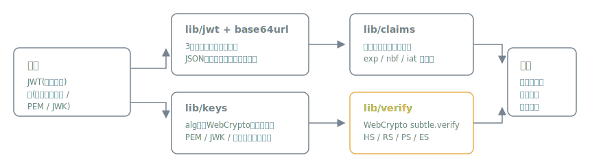

# jwtlens

[](https://github.com/miruky/jwtlens/actions/workflows/ci.yml)
[](https://www.typescriptlang.org/)
[](https://vitest.dev/)
[](https://opensource.org/licenses/MIT)

**JWTのデコードと署名検証を、トークンも鍵も一切外部に送らずブラウザ内だけで行うツールです。**

## 概要

JWTを貼り付けると、ヘッダとペイロードを色分け表示し、`exp` / `nbf` / `iat` などの登録済みクレームを日本語の解釈つきで表にします。失効済みか、まだ有効でないか、失効しないトークンかをその場で判定します。署名はWeb Crypto APIで検証でき、HS系は共有シークレット、RS / PS / ES系は公開鍵(PEMまたはJWK)を貼るだけです。

動かす: https://miruky.github.io/jwtlens/

### なぜ作ったのか

JWTのデバッグでオンラインのデコーダにトークンを貼る場面は多いですが、本物のアクセストークンには個人情報や権限情報が入っており、外部サービスに送ること自体がリスクです。jwtlensは静的サイトとして配信され、入力されたトークンと鍵をネットワークに一切流しません。検証ロジックもブラウザ標準のWeb Crypto APIだけで完結させ、暗号ライブラリへの依存を持ちません。

## 使い方

1. トークン欄にJWTを貼る(`Bearer ` 接頭辞ごとでも受け付ける)
2. ヘッダ・ペイロード・クレーム解釈・失効状態が即座に表示される
3. 鍵欄にシークレットまたは公開鍵を貼って「署名を検証」を押す

`exp` / `nbf` までの残り時間は1秒ごとに更新され、見ている間に失効すれば判定もその場で切り替わります。`iat`(または `nbf`)から `exp` までの有効期間は1本の帯で示し、現在位置のつまみが時間とともに進みます。あわせて「Checks」欄に、失効・時刻の異常・署名方式といった安全性の観察を重大度つきで列挙します(`alg=none`、`exp` の欠如、長すぎる有効期間、未来の `iat` など)。ヘッダ・ペイロードのJSONと生トークンはコピーボタンで取り出せます。配色はライト・ダーク・自動の3択で、選択はブラウザに記憶されます。「HS256サンプルを生成」を押すと、その場で署名した動作確認用トークンとシークレットが入ります。`alg=none` のトークンは署名を持たない非セキュアトークンとして強調表示し、検証ボタンを無効にします。

### 鍵の入力形式

| algの系統                 | 貼るもの                                           |
| :------------------------ | :------------------------------------------------- |
| HS256 / HS384 / HS512     | 発行側と共有しているシークレット文字列             |
| RS / PS / ES系            | 公開鍵。PEM(`-----BEGIN PUBLIC KEY-----`)またはJWK |
| JWK Set(`{"keys":[...]}`) | 先頭の鍵を使用                                     |

秘密鍵を貼った場合は検証せず、公開鍵だけで足りることを案内します。PKCS#1形式のRSA鍵と証明書は未対応で、SPKI形式への変換コマンドを表示します。JWE(暗号化トークン)とEdDSAも未対応です。

## アーキテクチャ



トークンの分解(`lib/jwt`)、クレーム解釈(`lib/claims`)、鍵とアルゴリズムの解決(`lib/keys`)、検証(`lib/verify`)をDOM非依存の純粋なモジュールに分け、UIは結果を表示するだけの薄い層にしています。検証はWeb Cryptoの実鍵を使ったテストで、HS / RS / ESそれぞれの署名→検証の往復と改ざん検出を確認しています。

## 技術スタック

| カテゴリ | 技術                           |
| :------- | :----------------------------- |
| 言語     | TypeScript 5(strict)           |
| 暗号     | Web Crypto API(実行時依存なし) |
| ビルド   | Vite                           |
| テスト   | Vitest(76テスト)               |
| リンタ   | ESLint + Prettier              |
| CI / CD  | GitHub Actions                 |
| 配信     | GitHub Pages                   |

## プロジェクト構成

- `src/lib/base64url.ts` — RFC 7515のbase64urlエンコード・デコード
- `src/lib/jwt.ts` — トークンの分解と構文検査(セグメント数・JSON妥当性)
- `src/lib/claims.ts` — 登録済みクレームの日本語解釈と失効判定
- `src/lib/lifetime.ts` — iat/nbf〜expの有効期間と現在位置の算出(帯表示に使う)
- `src/lib/checks.ts` — 失効・時刻・署名方式の安全性観察を重大度つきで導く
- `src/lib/keys.ts` — alg名からWebCryptoパラメータへの対応、PEM / JWK / シークレットの判別
- `src/lib/verify.ts` — Web Crypto APIによる署名検証とHS256サンプル生成
- `src/lib/highlight.ts` — 整形JSONを構文単位に分けるトークナイザ(色分け表示に使う)
- `src/theme.ts` — ライト・ダーク・自動の切り替えと永続化
- `src/icons.ts` — UIで使うモダンSVGアイコン(currentColor)
- `src/app.ts` — 画面の構築と各モジュールの結線
- `docs` — アーキテクチャ図
- `.github/workflows` — CIとGitHub Pagesデプロイ

## はじめ方

### 前提条件

- Node.js 20以上

### セットアップ

```bash
git clone https://github.com/miruky/jwtlens.git
cd jwtlens
npm install
npm run dev
```

### テストの実行

```bash
npm test
```

### Lintの実行

```bash
npm run lint
```

### デプロイ

`main` ブランチへのプッシュでGitHub Actionsがビルドし、GitHub Pagesへ自動デプロイします。

## 設計方針

- **送信ゼロ** — トークンも鍵もネットワークに流さない。fetchを1箇所も持たない静的サイト
- **暗号ライブラリ非依存** — 署名検証はWeb Crypto APIのみ。依存の脆弱性追跡から解放される
- **純粋ロジックの分離** — 分解・解釈・鍵解決・検証をDOM非依存のモジュールにし、Vitestで実鍵を使って検証
- **誤用への案内** — 秘密鍵の貼り付け、alg=none、鍵形式の取り違えは、エラーではなく次にすべきことを伝える

## ライセンス

[MIT](LICENSE)
